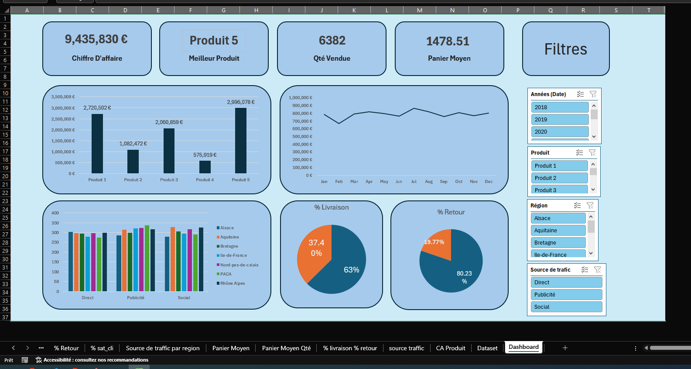

# Analyse des Ventes et Clients par Régions - France

**Microsoft Excel + Tableaux Croisés Dynamiques** | **Dashboard de Performance Commerciale**

## 📋 Contexte du Projet

Ce projet présente une analyse des ventes et du comportement client d’une entreprise opérant sur le territoire français.  
L’objectif est de suivre les performances commerciales par **région**, **produit**, **source de trafic** et **période**, tout en analysant les indicateurs de satisfaction client, de retours et de délais de livraison.

Le dashboard a été entièrement réalisé dans **Microsoft Excel** en utilisant des **Tableaux Croisés Dynamiques (Pivot Tables)** et des **Graphiques dynamiques**.

## 🎯 Objectifs

- Calculer et suivre les indicateurs clés de performance (CA, quantité vendue, panier moyen…)
- Analyser la performance des ventes par région française
- Identifier les meilleurs produits et les sources de trafic les plus efficaces
- Évaluer la qualité de service via le taux de retour et la satisfaction client
- Fournir une vue interactive et actualisable pour le suivi commercial

## 📊 KPI Principaux

| Indicateur                  | Valeur              |
|----------------------------|---------------------|
| **Chiffre d’Affaires Total** | **9 435 830 €**    |
| **Meilleur Produit**       | **Produit 5**      |
| **Quantité Totale Vendue** | **6 382**          |
| **Panier Moyen**           | **1 478,51 €**     |

## 📈 Visualisations Principales

- **CA par Produit** : Comparaison des 5 produits (Produit 5 largement en tête avec 2 996 078 €)
- **Évolution mensuelle du Chiffre d’Affaires** sur l’année
- **Répartition des sources de trafic** par région (Direct, Publicité, Social)
- **Taux de Livraison** : 63 % des commandes livrées dans les délais
- **Taux de Retour** : 19,77 % des commandes retournées
- **Performance par région** : Alsace, Aquitaine, Bretagne, Île-de-France, Nord-Pas-de-Calais, PACA, Rhône-Alpes

## 🛠️ Données et Méthodologie

- **Source** : Une seule feuille nommée **"Dataset"** contenant les colonnes suivantes :
- Date
- Source de trafic (Direct, Publicité, Social)
- Région (Alsace, Aquitaine, Bretagne, Île-de-France, etc.)
- Produit (Produit 1 à Produit 5)
- Prix
- Unité
- CA
- Délai de livraison
- Retour (Oui/Non)
- Satisfaction client

- **Outils utilisés** :
- Tableaux Croisés Dynamiques (Pivot Tables)
- Graphiques dynamiques liés aux tableaux croisés
- Slicers (Filtres interactifs) pour :
- Années (2018, 2019, 2020)
- Produit
- Région
- Source de trafic

- Mise en forme professionnelle avec thème de couleurs cohérent et organisation claire des visuels.

## 💡 Insights Clés

- Le **Produit 5** domine largement les ventes avec près de 3 millions d’euros de CA.
- L’**Île-de-France** et la **Rhône-Alpes** apparaissent comme des régions très actives.
- La source de trafic **"Publicité"** génère un volume important de commandes.
- Le taux de retour reste relativement élevé (près de 20 %), ce qui représente un axe d’amélioration potentiel.
- Le panier moyen est élevé (1 478 €), indiquant des commandes de valeur significative.

## 🔍 Comment utiliser ce dashboard

1. Ouvrir le fichier Excel
2. Utiliser les **Slicers** (filtres à droite) pour sélectionner l’année, le produit, la région ou la source de trafic
3. Toutes les visualisations et KPI se mettent à jour automatiquement grâce aux tableaux croisés dynamiques

---

**Auteur :** Hamza KHIAR  
**Date :** Avril 2026  
**Outil :** Microsoft Excel (Tableaux Croisés Dynamiques)  
**Portfolio Data Analyst**
